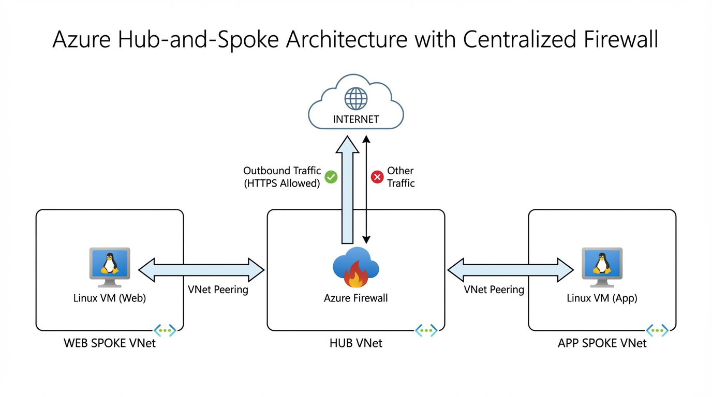

# Azure Hub-and-Spoke Network with Centralized Firewall

This project demonstrates a real-world Azure Hub-and-Spoke network architecture
focused on centralized security and outbound traffic control using Azure Firewall.

The environment was designed, deployed, validated, and then torn down to minimize
cloud costs.

## Architecture Overview

The solution follows a Hub-and-Spoke topology:

- A central Hub VNet hosts Azure Firewall for traffic inspection
- Two Spoke VNets (Web and App) host isolated workloads
- Spoke VNets do not have direct connectivity to the Internet
- All outbound traffic is forced through Azure Firewall

## Network Design

- Hub-and-Spoke topology for centralized control
- No direct VNet peering between Spokes
- All east-west and outbound traffic traverses the Hub
- Azure Firewall enforces a deny-by-default security model

## IP Addressing Plan

### Virtual Networks

| VNet | Address Space |
|-----|---------------|
| Hub VNet | 10.0.0.0/16 |
| Web Spoke VNet | 10.1.0.0/16 |
| App Spoke VNet | 10.2.0.0/16 |

### Subnets

| VNet | Subnet | Address Prefix |
|-----|--------|----------------|
| Hub | AzureFirewallSubnet | 10.0.1.0/26 |
| Hub | Management Subnet | 10.0.2.0/26 |
| Web Spoke | Web Subnet | 10.1.1.0/24 |
| App Spoke | App Subnet | 10.2.1.0/24 |

## Routing and Traffic Control

- User Defined Routes (UDRs) are applied to Spoke subnets
- Default route (0.0.0.0/0) points to Azure Firewall
- This prevents direct Internet access from workloads
- Routing behavior was validated using effective routes

## Security Controls

- Azure Firewall (Basic SKU) deployed in the Hub
- Deny-by-default policy enforced
- Application Rules allow outbound HTTPS traffic only
- No public IPs assigned to workload VMs

## Validation and Testing

The following tests were performed:

- HTTPS outbound traffic allowed (validated with curl)
- ICMP traffic blocked by default (validated with ping)

## Cost Management

All billable resources (Azure Firewall, Bastion, VMs) were deployed temporarily
for validation and removed after testing to control costs.

## Conclusion

This project demonstrates practical Azure networking skills including
hub-and-spoke design, routing control, firewall configuration, and
real-world troubleshooting.
